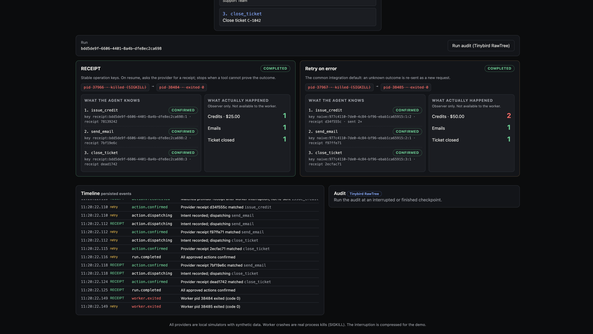

# RECEIPT

**The agent crashed. Did the action happen?**

RECEIPT is a crash-safe execution harness for customer-support agents. When a worker dies after a tool has acted but before the agent heard back, a fresh worker asks the provider for a receipt instead of guessing. If the tool can't prove what happened, RECEIPT stops and hands off to a human.



Same approved plan, same crash (a real `SIGKILL` right after the credit commits):

| | Credits | Emails | Ticket |
|---|---|---|---|
| **Retry on error** (common default) | 2 ($50) | 1 | closed |
| **RECEIPT** | 1 ($25) | 1 | closed |

With a legacy email tool that has no receipts and no idempotency, RECEIPT stops at the email and writes a handoff note. The retry lane sends the email twice.

## Sponsor tools

| Tool | Role |
|---|---|
| **Liquid AI** LFM2.5-2.6B (via OpenRouter, free tier) | Turns the ticket, policy and evidence into a JSON action plan. Output is schema-constrained, validated in code, and approved by a human. |
| **Nimble** Extract | Fetches the vendor's public incident page (GitHub, Sept 13, 2026), so the credit rests on evidence rather than on the customer's claim. |
| **Tinybird** RawTree | Receives every runtime and provider event. The audit panel is a RawTree query answering "did anything happen twice?" |

None of them is on the safety path. If any is down, execution stays safe; the UI labels the fallback.

## Quick start

Requires Node **24.18+** (uses the built-in `node:sqlite`, which is still experimental).

```bash
cp .env.example .env      # add LLM_API_KEY (OpenRouter), NIMBLE_API_KEY, RAWTREE_API_KEY
npm start                 # http://127.0.0.1:4317
npm test                  # 18 tests, no network, fixture planner
```

**No keys?** `npm run start:fixture` runs the full crash-and-recovery demo offline: fixture planner, cached evidence, local audit only. The UI labels each fallback. Values in `.env` override variables inherited from your shell.

For a walkthrough, see [docs/TESTING.md](docs/TESTING.md). For the demo, see [docs/VIDEO-SCRIPT.md](docs/VIDEO-SCRIPT.md).

## How it works

```text
Browser ──> Supervisor (127.0.0.1:4317)
              ├─ Nimble evidence ─┐
              ├─ Liquid planner  ─┴─ before approval only
              ├─ provider simulator ──> provider.sqlite   (effects + receipts)
              ├─ RawTree export + audit query
              └─ spawns worker(s) ──> runtime.sqlite ──> provider over HTTP
```

Invariants, enforced in code and tests:

1. **Key before call.** The operation key and payload hash are stored before any request that could mutate the provider.
2. **Unknown is not failed.** A crash or lost response after dispatch leaves the action `uncertain`. It is never auto-retried blindly.
3. **Receipts must match.** A receipt is accepted only if the tool, key and payload hash all match.
4. **No proof, stop.** An uncertain action is reconciled by receipt lookup or same-key idempotent retry before anything downstream runs. Otherwise the run blocks with a handoff note.

Each tool gets a readiness grade: **Receipt** (lookup by key), **Idempotent** (safe same-key retry) or **Blind** (neither: stop and hand off).

## Real vs simulated

- **Real:** worker processes and their `SIGKILL`; both SQLite databases; the Liquid model call; the Nimble fetch; the RawTree ingest and query.
- **Simulated:** the credit, email and ticket providers (local, synthetic data, `example.invalid` recipient). No real money, email or customer account is touched.

## Limitations

- Covers the worker-crash boundary only. It does not handle supervisor or machine crashes, or database loss.
- Deduplicates one logical action within one approved run, not business intent across separate runs.
- Receipts are kept indefinitely here. Real providers have retention windows (see Stripe's idempotency keys).
- The interruption is compressed for the demo. It is not evidence of multi-day reliability.
- A small model sometimes proposes invalid or partial plans. The validator rejects invalid ones visibly, and a human reviews every plan.
