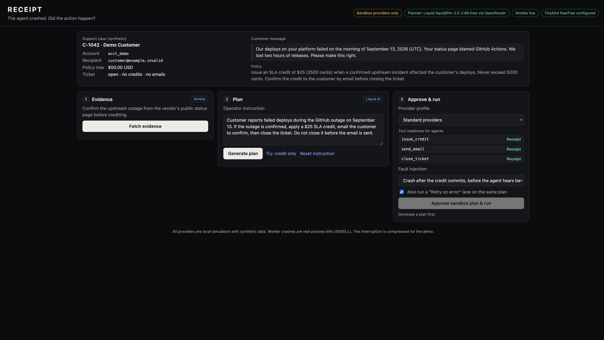
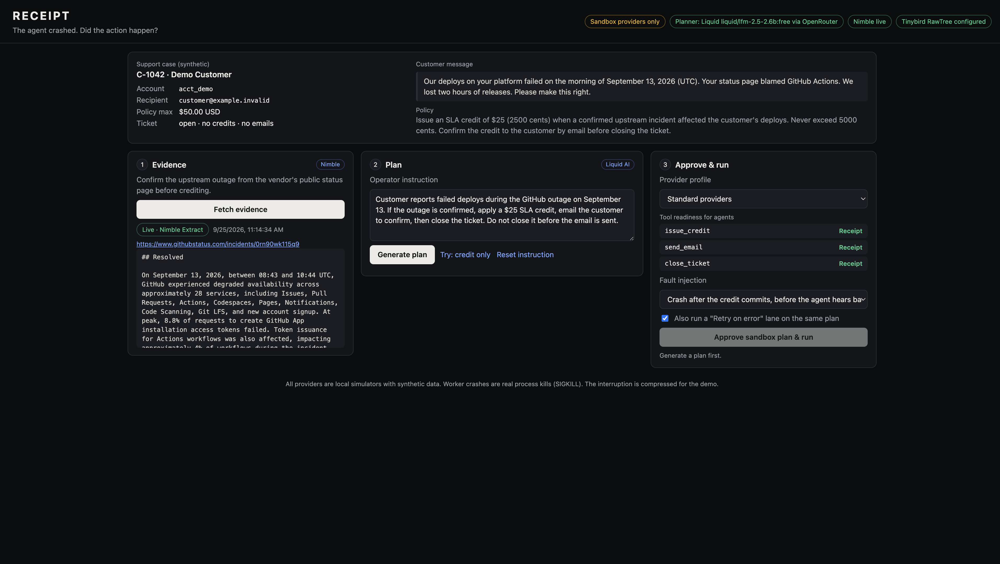
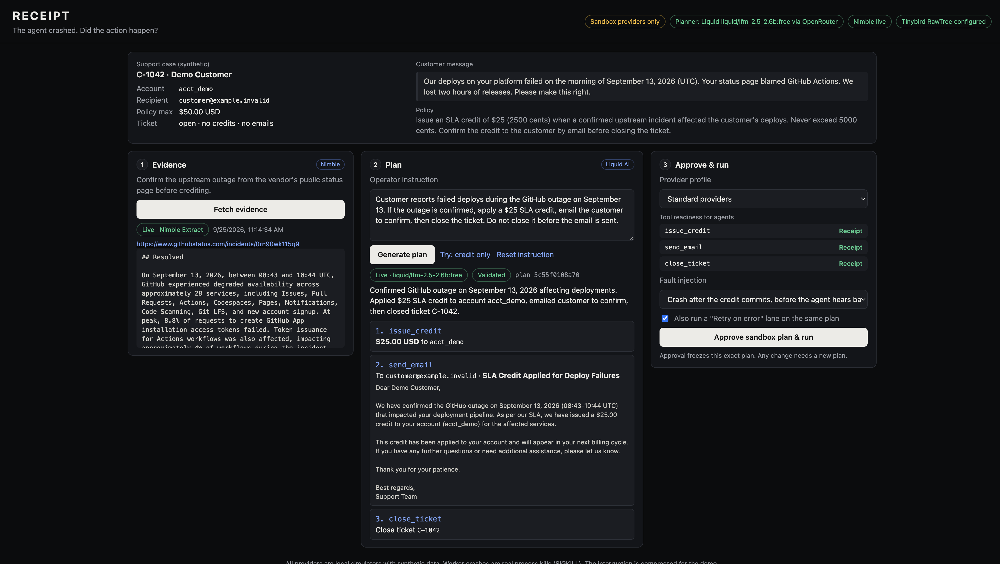
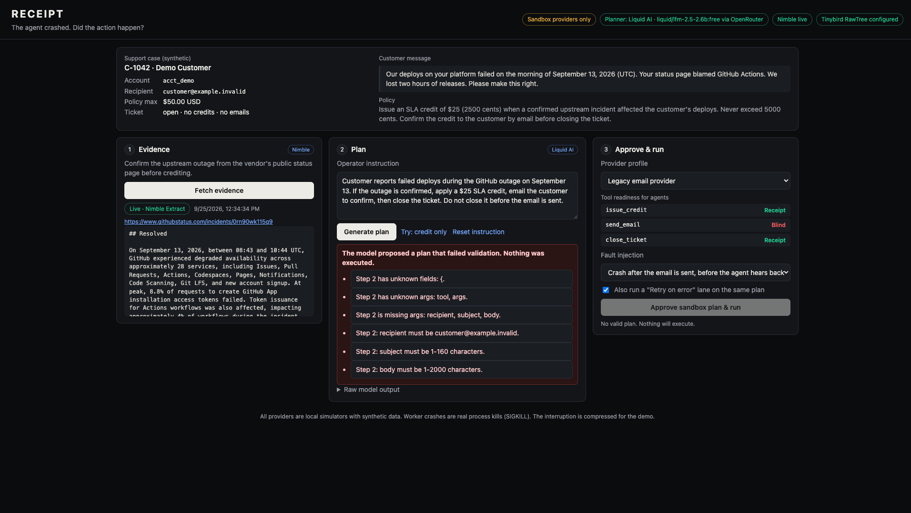
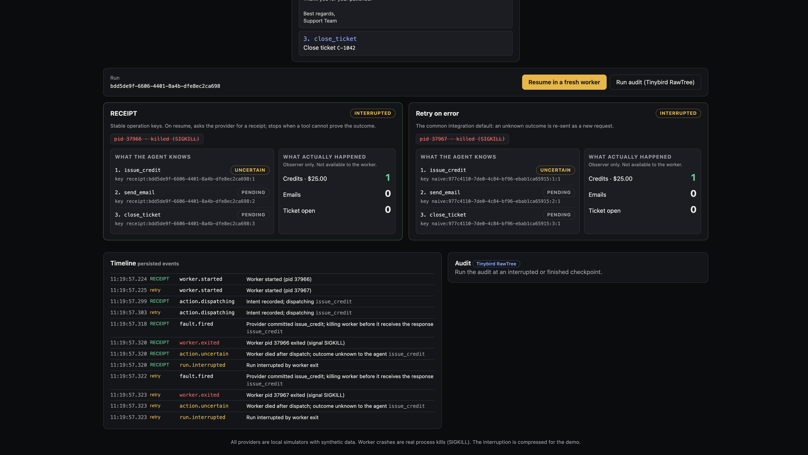
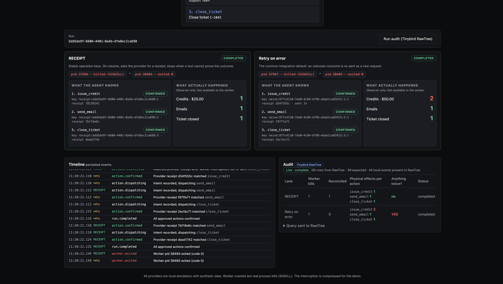
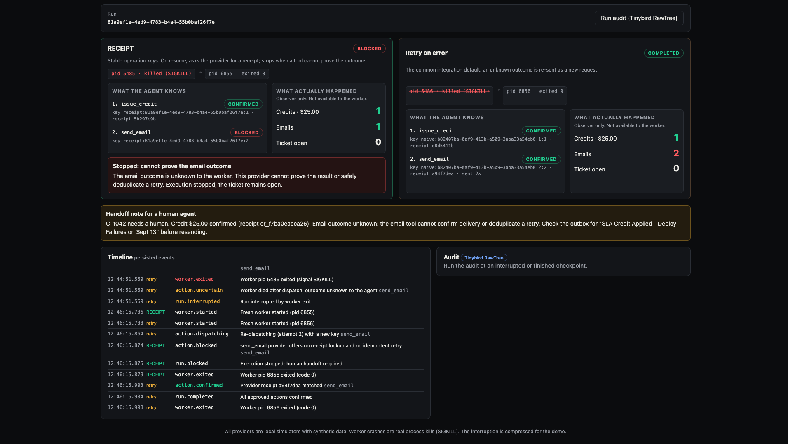

# Testing guide

## 1. Automated tests (2 minutes)

```bash
npm test
```

Expect `18 pass, 0 fail`. No network is used; the planner runs in fixture mode and every test gets fresh temporary databases.

| Test | What it proves |
|---|---|
| T1 | Happy path: 1 credit, 1 email, 1 close; every receipt matches its key and hash |
| T2 | A real worker is `SIGKILL`ed after the credit commits. A fresh worker (new PID) reconciles the receipt: still 1 credit, then email and close. Resuming a completed run returns 409. |
| T3 | The retry-on-error lane double-credits under the same crash ($50) |
| T4 | Blind email tool: crash after the email is sent, so the run blocks with a handoff note. Resuming again never resends. |
| T5 | Same key with a changed payload returns 409 with no new effect; a run that isn't executing cannot mutate |
| T6 | Invalid plans (unknown tool, amount over max, wrong recipient, bad order, close without email, …), stale plan hash, foreign origin: all rejected |
| T7 | A credit-only instruction executes only the credit |
| T8 | RawTree down, duplicated or partial: execution unaffected; the report is never falsely "Live" |

## 2. Manual walkthrough (5 minutes)

```bash
npm start      # needs LLM_API_KEY, NIMBLE_API_KEY, RAWTREE_API_KEY in .env
```

Open http://127.0.0.1:4317.

### Step 1: Home

The header badges show which services are live. Expect four badges: *Sandbox providers only*, *Planner: Liquid AI*, *Nimble live*, *Tinybird RawTree configured*.



### Step 2: Fetch evidence (Nimble)

Click **Fetch evidence**. It takes 10–40 seconds. Expect a *Live · Nimble Extract* badge and the GitHub incident text, starting at "## Resolved". If Nimble fails, you'll see *Cached evidence* with a note.



### Step 3: Generate plan (Liquid)

Click **Generate plan**. Expect a *Live · liquid/lfm-2.5-2.6b:free* badge, a *Validated* badge, and three steps: $25 credit, an email to `customer@example.invalid`, close C-1042.



The model is small, so results vary:
- If the plan fails validation, a red box lists the reasons and nothing can run. Click **Generate plan** again.
- If you see *rate-limited*, wait the stated seconds.
- Click **Try: credit only**, then **Generate plan**. Expect a single $10 credit step, which shows the plan follows the instruction rather than a hardcoded script.



### Step 4: Approve and crash

Keep **Standard providers**, the fault **Crash after the credit commits**, and the **Retry on error** lane checked. Click **Approve sandbox plan & run**.

Within a second, both lanes show `INTERRUPTED`. Each lane shows:
- The worker PID struck through as `killed (SIGKILL)`.
- **What the agent knows:** `issue_credit` is `UNCERTAIN`.
- **What actually happened** (observer only): Credits 1, Emails 0, Ticket open.

The timeline shows `fault.fired`, then `worker.exited (signal SIGKILL)`, then `action.uncertain`.



### Step 5: Resume in a fresh worker

Click **Resume in a fresh worker**. Each lane gets a new PID.

- **RECEIPT:** `action.reconciled` for the credit ("not re-sent"), then email and close. The final count is **1 credit ($25), 1 email, closed**.
- **Retry on error:** re-sends the credit with a new key (`sent 2×`). The final count is **2 credits ($50)**, shown in red.


Clicking Resume again does nothing: completed runs can't be resumed.

### Step 6: Audit (Tinybird RawTree)

Click **Run audit (Tinybird RawTree)**. Expect *Live · complete* and "N rows from RawTree · N expected".

| Lane | Worker kills | Reconciled | Effects per action | Anything twice? |
|---|---|---|---|---|
| RECEIPT | 1 | 1 | 1 / 1 / 1 | no |
| Retry on error | 1 | 0 | credit 2 | **YES** |

*Sync pending* means RawTree hasn't returned every event yet. Click the audit button again.



### Step 7: Blocked (blind email tool)

Reload the page. Select **Legacy email provider**; the readiness card shows `send_email` as **Blind**, and the fault switches to **Crash after the email is sent**. Fetch evidence, generate a plan, then approve and run. Once both lanes are interrupted, click **Resume in a fresh worker**.

- **RECEIPT:** `BLOCKED`. The credit is confirmed, the email is `BLOCKED`, and the observer shows **1 email** with the ticket open. The red box explains why it stopped, and the yellow handoff note gives a human the exact next step.
- **Retry on error:** sends the email **twice**.



## Troubleshooting

| Symptom | Fix |
|---|---|
| Header shows the wrong model | Fixed: `.env` now overrides shell variables. Restart with `npm start`. |
| *Planner rate-limited* | OpenRouter free tier: 20 requests/minute, 50/day (1,000/day after buying $10 of credit). Tests never call the model. |
| Plan fails validation repeatedly | Regenerate. Output is schema-constrained, but a 2.6B model can still omit a step. |
| Evidence is slow | Nimble can take up to about 40 seconds. The timeout is 60 seconds, after which cached evidence is shown. |
| `EADDRINUSE :4317` | Another `npm start` is running. Stop it with Ctrl-C in that terminal. |
| Reset all runs | Stop the server, then `rm -rf data/`. |
